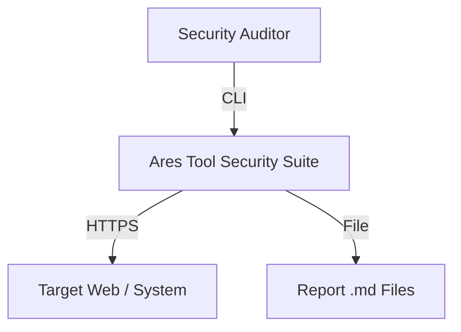
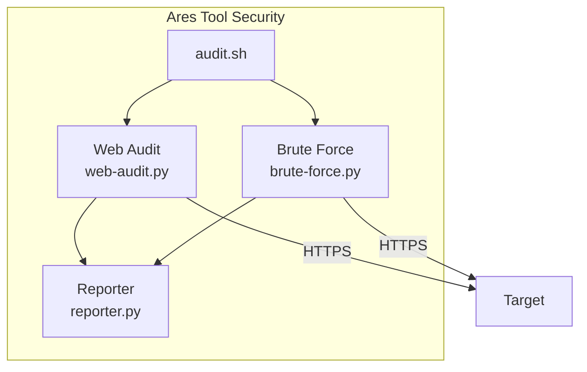

# Ares Tool Security Architecture

## C4 Level 1 — Context


## C4 Level 2 — Containers


## Module Execution Flow
```
audit.sh → Interactive menu
  ├── User selects module
  ├── User enters target
  ├── audit.sh runs python3 modules/<module>.py <target>
  │     ├── Scans/Tests the target
  │     ├── Reports findings in terminal
  │     └── Generates .md report in reports/
  └── Returns to main menu
```

## Report Generation Flow
```
Module (.py) → AuditReport class (lib/reporter.py) → .md file (reports/)
                                                           │
                    ┌──────────────────────────────────────┤
                    │                                      │
                    ▼                                      ▼
      lib/report-html.py (.md → .html)        docs/FORGE_REPORT.md
      (native converter)                       (AI prompt for HTML)
```
