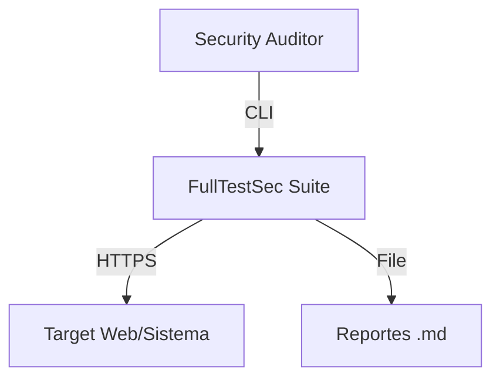

# FullTestSec Architecture

## C4 Level 1 — Context


## C4 Level 2 — Containers


## Flujo de un Módulo
```
audit.sh → Menú interactivo
  ├── Usuario selecciona módulo
  ├── Usuario ingresa target
  ├── audit.sh ejecuta python3 modules/<module>.py <target>
  │     ├── Escanea/Prueba el target
  │     ├── Reporta findings en terminal
  │     └── Genera reporte .md en reports/
  └── Vuelve al menú principal
```
